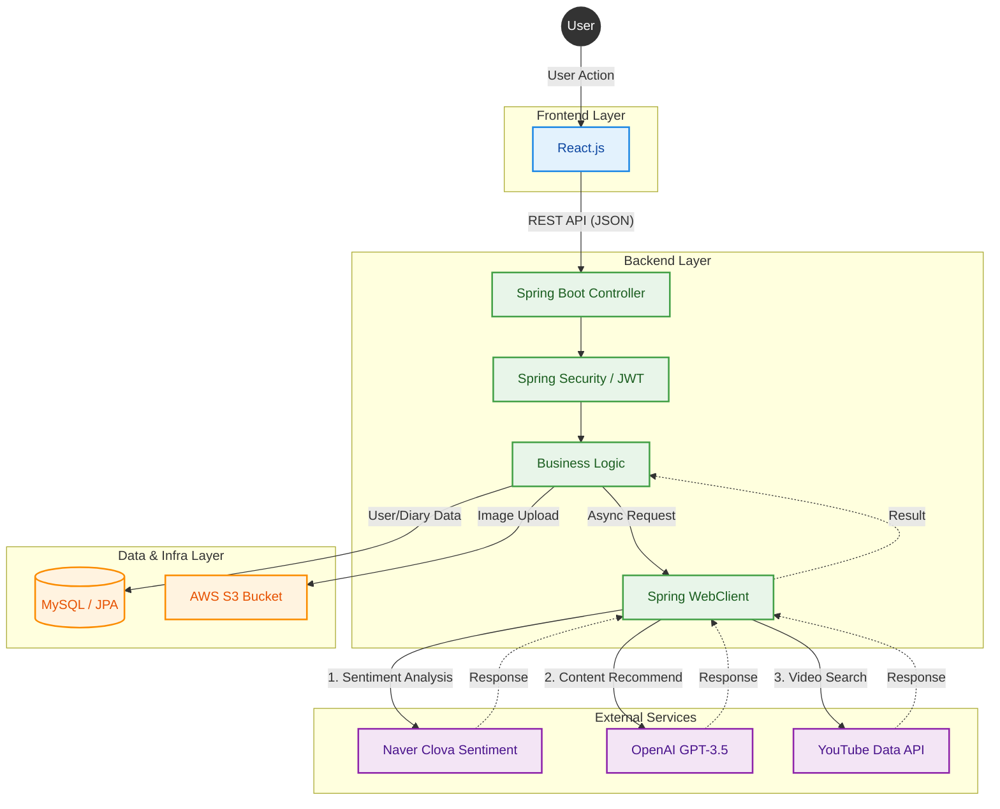

# 📘 BlueMemories

> **"당신의 감정을 이해하고 위로하는 AI 스마트 다이어리"**

## 💡 프로젝트 배경 (Project Background)

> **"어떻게 하면 사용자가 자신의 감정을 더 쉽고 깊이 있게 돌아볼 수 있을까?"**

이 질문에서 시작된 **BlueMemories 리뉴얼 프로젝트**입니다. 
기존 Ver 1.0의 아쉬웠던 점을 보완하고 사용자 경험(UX)을 극대화하기 위해 **디자이너와 1:1 협업**을 통해 UI/UX를 전면 개편했습니다.

### 🔄 주요 변화 (Key Changes)
* **Core Value:** '일기 작성'과 '콘텐츠 추천'이라는 핵심 경험에 집중하되, 인터페이스를 훨씬 직관적으로 개선했습니다.
* **Expansion:** 기존의 1:1 교환 일기를 여러 명이 함께 쓰는 **'공유 일기장'**으로 확장하고, 소통을 위한 **'커뮤니티'** 기능을 신설했습니다.
* **Feedback:** 실제 리뉴얼 후 테스터들로부터 *"이전 버전보다 훨씬 직관적이며, 특히 '감정 캘린더' 기능 덕분에 나의 감정 변화를 돌아보는 것이 즐거워졌다"* 는 긍정적인 피드백을 받았습니다.

---

## 🏗️ 시스템 아키텍처 (System Architecture)

전체 서비스의 데이터 흐름과 외부 API 연동 구조도입니다.

### ⚙️ 핵심 프로세스
1.  **감정 분석:** 사용자가 일기를 작성하면 `Naver Clova API`가 텍스트를 분석하여 감정 점수를 반환합니다.
2.  **AI 추천:** 분석된 감정을 기반으로 `OpenAI(GPT)`가 맞춤형 검색어(노래/영상)를 생성합니다.
3.  **영상 매칭:** 생성된 검색어를 `YouTube API`에 질의하여 실제 영상 콘텐츠를 사용자에게 보여줍니다.
4.  **이미지 저장:** 사용자가 첨부한 사진은 `AWS S3` 버킷에 안전하게 저장됩니다.

---

## 📸 주요 기능 (Key Features)

**AWS 비용 및 중지된 API로 인해 서비스가 일시 중지되어, Figma 디자인 시안으로 기능을 소개합니다.**

| 기능 1. 감정 분석 및 AI 추천 |
| :--- |
| **"내 감정을 숫자로, 내 기분을 노래로"**   일기를 쓰면 긍정, 중립, 부정 수치가 나타나며,   오늘의 기분에 맞는 유튜브 영상을 추천해드립니다. |
| |
| |

| 기능 2. 교환 일기 (Shared Diary) |
| :--- |
| **"친구와 함께 쓰는 비밀 이야기"**   친구를 초대하여 우리만의 교환 일기장을 만들 수 있습니다.   멤버 관리 및 초대/수락 기능을 제공합니다. |
||
||
||

| 기능 3. 커뮤니티 & 좋아요 |
| :--- |
| **"서로의 일상 공유"**   공개 설정된 일기는 커뮤니티에 공유됩니다.   다른 사용자의 일기에 좋아요와 댓글을 남기며 소통하세요. |
||
||

---

## 🛠 기술 스택 (Tech Stack)

### Backend
* **Core:** Java 17, Spring Boot 3.x
* **Data:** Spring Data JPA, H2/MySQL
* **Security:** Spring Security, JWT
* **Infra:** AWS S3 (Image Storage)

### Frontend
* **Core:** React.js, JavaScript (ES6+)
* **Styling:** Styled-components
* **Network:** Axios

### AI & External APIs
* **OpenAI API (GPT-3.5):** 추천 알고리즘 구현
* **Naver Cloud Platform (Clova):** 텍스트 감정 분석
* **YouTube Data API:** 멀티미디어 콘텐츠 검색

---

